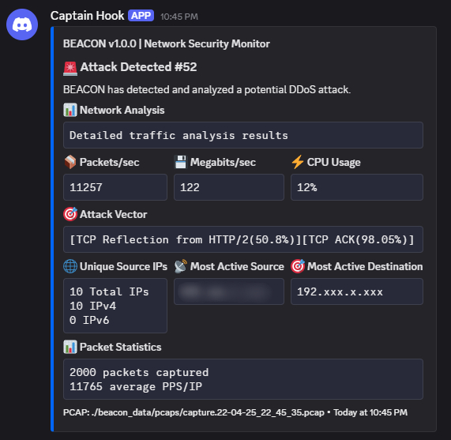
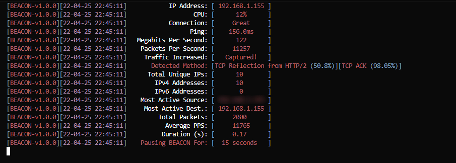

# <div align="center">🛡️ BEACON</div>
## <div align="center">Baseline Event Analysis & Connection Observer Network</div>

[](https://www.python.org/downloads/)
[](LICENSE)
[](https://discord.com)

BEACON is a Python3 layer-4 (D)DoS network monitor script with automatic attack vector detection, informative pcap json exports, highly-customizable Discord notifications, and more!

## ✨ Features

- Real-time network traffic monitoring
- Automatic DDoS attack detection
- Detailed attack statistics and analysis
- Discord notifications with rich embeds
- PCAP export and analysis

## 🚀 Quick Start

1. **Clone repository**
   ```bash
   git clone https://github.com/AnabolicsAnonymous/BEACON
   cd BEACON
   ```

2. **Install Dependencies**
   ```bash
   pip install -r requirements.txt
   ```

3. **Configure**
   - Copy `core/config.py.example` to `core/config.py`
   - Update your Discord webhook URL
   - Customize detection thresholds

4. **Run**
   ```bash
   python main.py
   ```

## 🛠️ Configuration

BEACON is highly customizable with Discord webhook payloads being drag and drop from [Dischook](https://discohook.org/) with dynamic values easily customizable.

## 📊 Attack Detection

BEACON monitors for:
- High packet rates (PPS)
- Bandwidth spikes (Mbps)
- Common DDoS attack vectors

## 📱 Discord Notifications

Receive rich notifications with:
- Attack vector details
- Source/destination IPs
- Packet statistics
- Timestamp and duration
- System metrics



## 🎨 CLI Interface



## 📦 Dependencies

- Python 3.8+
- scapy
- psutil
- requests

## 📃 TODO

- Add post-attack external command execution
- Use a Discord bot instead of webhooks
- Make Discord attack notifications edit instead of reposting
- Rewrite monitor to constantly update instead of pausing then restarting

## 📝 License

Licensed under the Affero General Public License v3.0 (AGPL-3.0) - see the [LICENSE](LICENSE) file for details.

## 🤝 Contributing
All issues and contributions are welcome, feel free to fix anything big or small or report issues or uncaught errors with a console log.

## 💖 Support

If you find this project useful, consider supporting it:

- Bitcoin: `bc1q7nxt23ahfluesy2kxgjdkqhh7qcc3gda6wmla5`
- Ethereum: `0x24D898b1BA57BC8F5B510A841EeE8c75dcD8397d`
- USDC: `0x24D898b1BA57BC8F5B510A841EeE8c75dcD8397d`
- Litecoin: `LL2pHmU4tYvKUCcBem3ehdrFeeuQuGbWNX`